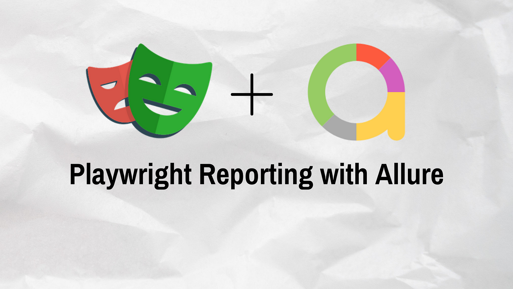

# Kriyadocs Regression Automation



## Overview
This repository contains regression automation tests for the Kriyadocs project. The automation framework is built using Playwright version 1.42.1, providing robust and efficient testing capabilities. All test results are reported using the allure-report reporter, offering detailed insights into test execution and results.

## Prerequisites
Before running the automation tests, ensure that the following software is installed:

- Node.js v16.17.0
- Playwright v1.42.1
- Allure-commandline

## Setup
1. Clone this repository to your local machine.
2. Install the project dependencies by running the following command:
    ```bash
    npm install
    ```
3. Configure the necessary environment variables for your test environment.

## Running Tests
To execute the regression automation tests, run the following command:
```bash
npx playwright test <file>
```
## Viewing Allure Test Reports
This command will generate the test report and open it in your default browser.

```bash
npx allure serve allure-results
```

